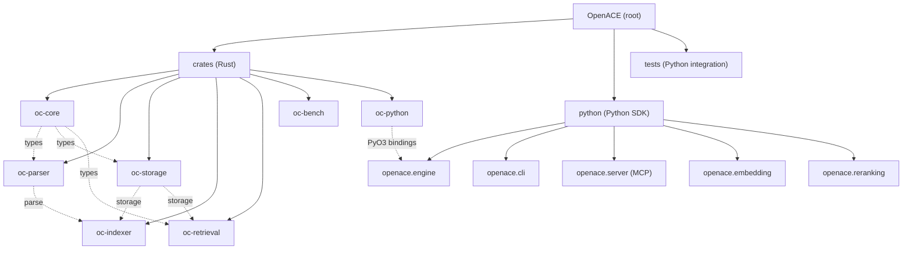

# CLAUDE.md

This file provides guidance to Claude Code (claude.ai/code) when working with code in this repository.

## Project Overview

OpenACE is an AI-native Contextual Code Engine: Rust core with Python bindings, exposing a CLI, Python SDK, and MCP server. It unifies semantic code search, IDE navigation, code intelligence, and real-time indexing.

## Architecture Overview

OpenACE is a **Rust + Python hybrid** monorepo. The performance-critical core (parsing, storage, indexing, retrieval) is implemented in Rust as a workspace of 7 crates. Python bindings are built via [maturin](https://www.maturin.rs/) + [PyO3](https://pyo3.rs/), and a pure-Python layer provides the high-level SDK, CLI, embedding providers, reranking, and an MCP server.

**Data flow:**

```
Source files --> Scanner --> Parser (tree-sitter) --> Indexer --> Storage (SQLite + Tantivy + usearch)
                                                                        |
Query -----> CLI/SDK/MCP --> RetrievalEngine (BM25 + vector kNN + exact + graph) --> Reranker --> Results
```

**Key design decisions:**
- Deterministic symbol IDs via XXH3-128 hashing of `repo_id|path|qualified_name|byte_start|byte_end`
- Triple-backend storage: SQLite (graph/relations), Tantivy (full-text BM25), usearch (HNSW vector kNN)
- Reciprocal Rank Fusion (RRF) to combine BM25, vector, exact-match, and graph-expansion signals
- Pluggable embedding providers (local ONNX, OpenAI, SiliconFlow) and rerankers (rule-based, cross-encoder, LLM-backed, API)
- GIL-released Rust operations via `py.allow_threads()` for Python concurrency
- Graceful degradation: each retrieval signal fails independently without crashing search
- Storage corruption auto-recovery: `.openace/` directory is purged and rebuilt on schema mismatch or SQLite corruption

## Module Structure



## Module Index

| Module | Path | Language | Description |
|--------|------|----------|-------------|
| oc-core | `crates/oc-core/` | Rust | Shared types: `CodeSymbol`, `SymbolId`, `CodeRelation`, `RelationKind`, `Language`, `QualifiedName` |
| oc-parser | `crates/oc-parser/` | Rust | Multi-language AST parser (tree-sitter) for Python, TypeScript/JS, Rust, Go, Java |
| oc-storage | `crates/oc-storage/` | Rust | Triple-backend storage: `GraphStore` (SQLite), `FullTextStore` (Tantivy), `VectorStore` (usearch) |
| oc-indexer | `crates/oc-indexer/` | Rust | Indexing pipeline: file scanning, parallel parsing (rayon), incremental updates, file watching |
| oc-retrieval | `crates/oc-retrieval/` | Rust | Multi-signal retrieval engine with RRF fusion (BM25 + vector + exact + graph expansion) |
| oc-bench | `crates/oc-bench/` | Rust | End-to-end tests and Criterion benchmarks |
| oc-python | `crates/oc-python/` | Rust | PyO3 bindings exposing `EngineBinding`, `WatcherBinding`, and Python-compatible types |
| Python SDK | `python/openace/` | Python | High-level `Engine` class, CLI (`click`), MCP server, embedding & reranking providers |
| Tests | `tests/` | Python | Integration tests for Engine, embedding, MCP server, and reranking |

## Build System and Development

### Prerequisites

- **Rust** >= 1.85.0 (2021 edition)
- **Python** >= 3.10
- **maturin** >= 1.7 (for building Rust -> Python extension)

### Build Commands

```bash
# Build Rust workspace (all crates)
cargo build
cargo build --release

# Build Python extension (development mode, editable install)
uv run maturin develop

# Build Python extension (release)
uv run maturin develop --release

# Install with optional dependencies
uv pip install -e ".[dev]"          # dev/test deps
uv pip install -e ".[onnx]"         # local ONNX embedding
uv pip install -e ".[openai]"       # OpenAI embedding
uv pip install -e ".[mcp]"          # MCP server support
uv pip install -e ".[rerank-local]" # local cross-encoder reranker
uv pip install -e ".[rerank-cohere]" # Cohere reranker
uv pip install -e ".[rerank-openai]" # OpenAI reranker
```

### CLI Usage

```bash
# Index a project
openace index /path/to/project
openace index /path/to/project --embedding local

# Search indexed project
openace search "parse XML" --path /path/to/project
openace search "parse XML" -p /path/to/project --embedding local --limit 20

# Start MCP server on stdio
openace serve /path/to/project
openace serve /path/to/project --embedding siliconflow --reranker siliconflow
```

### Python SDK Usage

```python
from openace import Engine

engine = Engine("/path/to/project")
report = engine.index()
results = engine.search("parse XML", limit=10)
symbols = engine.find_symbol("MyClass")
outline = engine.get_file_outline("src/main.py")
```

## Test Strategy

### Rust Tests

```bash
# Run all Rust unit + integration tests
cargo test

# Run tests for a specific crate
cargo test -p oc-core
cargo test -p oc-parser
cargo test -p oc-storage
cargo test -p oc-indexer
cargo test -p oc-retrieval
cargo test -p oc-bench

# Run benchmarks
cargo bench -p oc-bench
```

**Rust test locations:**
- Unit tests: inline `#[cfg(test)] mod tests` blocks in each source file
- Integration tests: `crates/oc-parser/tests/` (per-language: Python, TypeScript, Rust, Go, Java), `crates/oc-indexer/tests/` (pipeline, incremental), `crates/oc-bench/tests/` (e2e_incremental, e2e_search)
- Benchmarks: `crates/oc-bench/benches/` (parser_throughput, graph_khop, fulltext_bm25, vector_knn, index_full, index_incremental)

### Python Tests

```bash
# Run all Python integration tests
uv run pytest tests/

# Run specific test files
uv run pytest tests/test_engine.py
uv run pytest tests/test_embedding.py
uv run pytest tests/test_mcp.py
uv run pytest tests/test_reranking.py
```

**Python test locations:**
- `tests/conftest.py` -- shared fixtures (`sample_project`)
- `tests/test_engine.py` -- Engine index/search/find_symbol/file_outline/flush integration tests
- `tests/test_embedding.py` -- Embedding factory and provider tests
- `tests/test_mcp.py` -- MCP server creation and CLI tests
- `tests/test_reranking.py` -- Reranker protocol, rule-based, factory, and Engine integration tests

## Coding Conventions

### Rust

- Edition 2021, minimum Rust version 1.85.0
- Error handling via `thiserror` derive macros with per-crate error enums
- Serialization via `serde` with derive
- Hashing via `xxhash-rust` (XXH3-128 for IDs, XXH3-64 for content hashes)
- Parallel processing via `rayon`
- Tree-sitter for multi-language AST parsing
- SQLite via `rusqlite` with bundled feature
- Tests use `tempfile::TempDir` for filesystem isolation

### Python

- Python 3.10+ with `from __future__ import annotations`
- `dataclass(frozen=True)` for immutable data types
- `Protocol` (structural typing) for provider interfaces (`EmbeddingProvider`, `Reranker`)
- Factory pattern for creating providers (`create_provider()`, `create_reranker()`)
- Lazy imports to avoid loading the Rust extension at module import time
- `click` for CLI
- `pytest` for testing

## Key File Reference

### Rust Core
- `Cargo.toml` -- workspace definition and shared dependencies
- `crates/oc-core/src/symbol.rs` -- `CodeSymbol`, `SymbolId`, `SymbolKind`
- `crates/oc-core/src/relation.rs` -- `CodeRelation`, `RelationKind`
- `crates/oc-core/src/language.rs` -- `Language` enum (Python, TypeScript, JS, Rust, Go, Java)
- `crates/oc-core/src/qualified_name.rs` -- qualified name normalization
- `crates/oc-parser/src/visitor.rs` -- `parse_file()` entry point, language dispatch
- `crates/oc-parser/src/visitor/python.rs` -- Python AST visitor
- `crates/oc-parser/src/visitor/typescript.rs` -- TypeScript/JS AST visitor
- `crates/oc-parser/src/visitor/rust_lang.rs` -- Rust AST visitor
- `crates/oc-parser/src/visitor/go_lang.rs` -- Go AST visitor
- `crates/oc-parser/src/visitor/java.rs` -- Java AST visitor
- `crates/oc-storage/src/manager.rs` -- `StorageManager` facade over all backends
- `crates/oc-storage/src/graph.rs` -- `GraphStore` (SQLite-backed symbol/relation store)
- `crates/oc-storage/src/fulltext.rs` -- `FullTextStore` (Tantivy BM25 with code-aware tokenizer)
- `crates/oc-storage/src/vector.rs` -- `VectorStore` (usearch HNSW with surrogate key mapping)
- `crates/oc-indexer/src/pipeline.rs` -- `index()` full indexing pipeline
- `crates/oc-indexer/src/scanner.rs` -- `scan_files()` gitignore-aware file walker
- `crates/oc-indexer/src/incremental.rs` -- `diff_symbols()`, `update_file()`, `delete_file()`
- `crates/oc-indexer/src/watcher.rs` -- `start_watching()` file change watcher
- `crates/oc-retrieval/src/engine.rs` -- `RetrievalEngine` with multi-signal RRF fusion
- `crates/oc-python/src/lib.rs` -- PyO3 module definition
- `crates/oc-python/src/engine.rs` -- `EngineBinding` (GIL-released Rust engine)
- `crates/oc-python/src/types.rs` -- PyO3 type conversions

### Python SDK
- `pyproject.toml` -- Python project config, maturin build, optional deps
- `python/openace/__init__.py` -- lazy imports, public API surface
- `python/openace/engine.py` -- `Engine` class (high-level SDK)
- `python/openace/cli.py` -- CLI (`openace index`, `openace search`, `openace serve`)
- `python/openace/types.py` -- `Symbol`, `SearchResult`, `IndexReport`, `Relation` dataclasses
- `python/openace/exceptions.py` -- `OpenACEError` hierarchy
- `python/openace/server/app.py` -- MCP server (`semantic_search`, `find_symbol`, `get_file_outline` tools)
- `python/openace/embedding/protocol.py` -- `EmbeddingProvider` protocol
- `python/openace/embedding/factory.py` -- `create_provider()` factory
- `python/openace/embedding/local.py` -- `OnnxEmbedder` (all-MiniLM-L6-v2, 384-dim)
- `python/openace/embedding/openai_backend.py` -- `OpenAIEmbedder` (also used for SiliconFlow)
- `python/openace/reranking/protocol.py` -- `Reranker` protocol
- `python/openace/reranking/factory.py` -- `create_reranker()` factory
- `python/openace/reranking/rule_based.py` -- `RuleBasedReranker`
- `python/openace/reranking/cross_encoder.py` -- `CrossEncoderReranker`
- `python/openace/reranking/llm_backend.py` -- `LLMReranker` (Cohere/OpenAI)
- `python/openace/reranking/api_reranker.py` -- `APIReranker` (SiliconFlow/generic API)

## Storage Layout

Index data is stored in `<project_root>/.openace/`:
- `db.sqlite` -- SQLite database for symbols, relations, and file metadata (schema versioned)
- `tantivy/` -- Tantivy full-text index directory
- `vectors.usearch` -- usearch HNSW vector index file
- `vectors.usearch.keys` -- sidecar mapping file for SymbolId <-> u64 key translation
- `meta.json` -- metadata (e.g., `{"embedding_dim": 384}`)

## Supported Languages

Python, TypeScript, JavaScript, Rust, Go, Java.

## Tooling

- Always use `uv` when running Python commands (e.g., `uv pip install`, `uv run pytest`, `uv run maturin develop`). Do not use bare `pip` or `python` directly.

## AI Usage Guidelines

- The Rust core (`crates/`) handles all performance-critical operations; never reimplement indexing or retrieval in Python.
- The Python layer (`python/openace/`) is the user-facing interface; all new features should expose a Python API.
- When adding a new embedding provider, implement the `EmbeddingProvider` protocol and register it in `embedding/factory.py`.
- When adding a new reranker, implement the `Reranker` protocol and register it in `reranking/factory.py`.
- When adding a new language, add a tree-sitter grammar to `Cargo.toml` workspace deps, create a visitor in `crates/oc-parser/src/visitor/`, update `Language` enum in `oc-core`, and update `ParserRegistry`.
- MCP tools are defined in `python/openace/server/app.py`; add new tools there following the existing pattern.
- All storage operations go through `StorageManager`; never access SQLite/Tantivy/usearch directly.
- The `.openace/` directory is ephemeral and auto-recoverable; never store user data there.

## Environment Variables

- `OPENAI_API_KEY` -- required for OpenAI embedding/reranking
- `OPENACE_EMBEDDING` -- default embedding provider for `serve` command
- `OPENACE_RERANKER` -- default reranker for `serve` command

